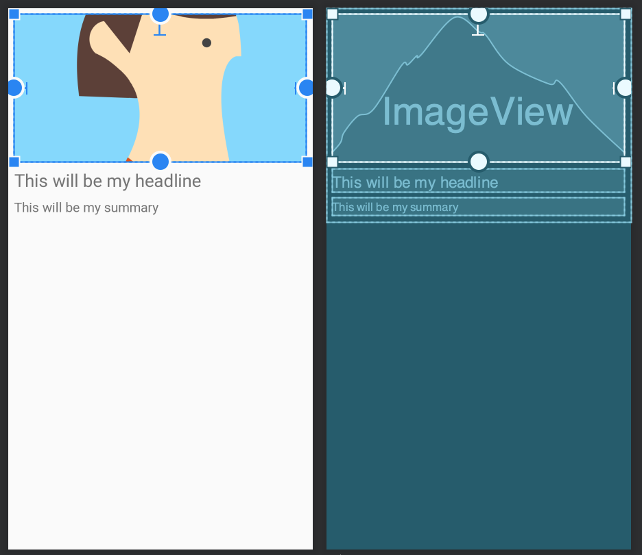

# Android Development Workshop

## The Goal

Build a NYTimes app using the [public API](https://developer.nytimes.com/):

https://developer.nytimes.com/


## Getting around Android Studio

- Project panel
- Emulator
- Run button


## Display the raw JSON

In `activity_main.xml`, give an `id` to the `TextView`

```xml
<TextView
    android:id="@+id/myTextView"
    android:layout_width="wrap_content"
    android:layout_height="wrap_content"
    android:text="Hello World!"
    app:layout_constraintBottom_toBottomOf="parent"
    app:layout_constraintLeft_toLeftOf="parent"
    app:layout_constraintRight_toRightOf="parent"
    app:layout_constraintTop_toTopOf="parent" />
```

In `MainActivity.kt`, set the text of `myTextView` to the API response.

```kotlin
// Map the section content from the response body.
response.body()?.let { section ->
    // Print the contents of the section in the debug logs.
    Log.d("MainActivity", section.toString())

    // Display the contents of the section in the TextView
    myTextView.text = section.toString()
}
```

## Displaying a list

- From activity_main.xml, open the "Design" tab
- Delete the `TextView`
- Drag to add a `RecyclerView`
- Give it an id: `recyclerView`


## Creating an adapter

In a new file NewsAdapter.kt

```kotlin
class NewsAdapter : RecyclerView.Adapter<NewsAdapter.NewsViewHolder>() {

    class NewsViewHolder(val headline: TextView) : RecyclerView.ViewHolder(headline)

    override fun onCreateViewHolder(parent: ViewGroup, viewType: Int): NewsViewHolder {
        // Called when a new, empty view is created
    }

    override fun getItemCount(): Int {
        // Tells the recycler view how many items to display
    }

    override fun onBindViewHolder(holder: NewsViewHolder, position: Int) {
        // Called when a view is about to be scrolled on to the screen
    }
}
```


## Create a view holder with a view to display the headline

In NewsAdapter.kt

```kotlin
    override fun onCreateViewHolder(parent: ViewGroup, viewType: Int): NewsViewHolder {
        // Called when a new, empty view is created
        val headlineTextView = TextView(parent.context)
        return NewsViewHolder(headlineTextView)
    }

```


## Create a list of data to bind with the adapter


In NewsAdapter.kt

```kotlin
class NewsAdapter : RecyclerView.Adapter<NewsAdapter.NewsViewHolder>() {

    var news: List<String> = ArrayList()
    //...
}
```


## We want to display as many headline items as there are news items

In NewsAdapter.kt

```kotlin
    override fun getItemCount(): Int {
        // Tells the recycler view how many items to display
        return news.size
    }
```


## When an item is scrolled onto the screen, show the headline

In NewsAdapter.kt

```kotlin
    override fun onBindViewHolder(holder: NewsViewHolder, position: Int) {
        // Called when a view is about to be scrolled on to the screen
        holder.headline.text = news[position]
    }
```

## Allow the news to be set from outside of the adapter

In NewsAdapter.kt

```kotlin
    var news: List<String> = emptyList()

    fun updateNews(news: List<String>) {
        this.news = news
        notifyDataSetChanged()
    }
```

## Setting up the RecyclerView

In MainActivity.kt

```kotlin
    lateinit var adapter : NewsAdapter

    override fun onCreate(savedInstanceState: Bundle?) {
        super.onCreate(savedInstanceState)
        setContentView(R.layout.activity_main)
        adapter = NewsAdapter()
        recyclerView.layoutManager = LinearLayoutManager(this)
        recyclerView.adapter = adapter
    }
```


## Map the API response to a list of headlines and update the adapter

In MainActivity.kt

```kotlin
// Map the section content from the response body.
response.body()?.let { section ->
    // Print the contents of the section in the debug logs.
    Log.d("MainActivity", section.toString())

    // Map the sections to a list of headlines and update the adapter
    val headlines = section.results.map { it.title }
    adapter.updateNews(headlines)
}
```


## Make a nicer layout

- Create a new layout file `item_news.xml`
- Add an ImageView and two TextViews and give them `id` values
- Adjust the constraints and margins to align the views
- Give the ImageView a placeholder background



The final contents of item_news.xml should look like:

```xml
<?xml version="1.0" encoding="utf-8"?>
<androidx.constraintlayout.widget.ConstraintLayout
    xmlns:android="http://schemas.android.com/apk/res/android"
    xmlns:app="http://schemas.android.com/apk/res-auto" xmlns:tools="http://schemas.android.com/tools"
    android:layout_width="match_parent"
    android:layout_height="wrap_content">

    <ImageView
        android:layout_width="match_parent"
        android:layout_height="200dp" tools:srcCompat="@tools:sample/avatars" android:id="@+id/imageView"
        android:layout_marginTop="8dp"
        app:layout_constraintTop_toTopOf="parent" app:layout_constraintStart_toStartOf="parent"
        android:layout_marginStart="8dp" app:layout_constraintEnd_toEndOf="parent" android:layout_marginEnd="8dp"
        android:background="@android:color/darker_gray" android:scaleType="centerCrop"/>
    <TextView
        android:text="TextView"
        android:layout_width="match_parent"
        android:layout_height="wrap_content" android:id="@+id/headline"
        android:layout_marginTop="8dp"
        app:layout_constraintTop_toBottomOf="@+id/imageView" app:layout_constraintStart_toStartOf="parent"
        android:layout_marginStart="8dp" app:layout_constraintEnd_toEndOf="parent" android:layout_marginEnd="8dp"
        android:fontFamily="serif" android:textSize="24sp"/>
    <TextView
        android:text="TextView"
        android:layout_width="match_parent"
        android:layout_height="wrap_content" android:id="@+id/summary"
        android:layout_marginTop="8dp"
        app:layout_constraintTop_toBottomOf="@+id/headline" app:layout_constraintStart_toStartOf="parent"
        android:layout_marginStart="8dp" app:layout_constraintEnd_toEndOf="parent" android:layout_marginEnd="8dp"
        android:fontFamily="serif" android:textSize="18sp"/>

</androidx.constraintlayout.widget.ConstraintLayout>
```


## Inflate the layout in the adapter

In NewsAdapter.kt

```kotlin
class NewsAdapter(val context: Context) : RecyclerView.Adapter<NewsAdapter.NewsViewHolder>() {

	  class NewsViewHolder(view: View) : RecyclerView.ViewHolder(view)

    val inflater = LayoutInflater.from(context)

    //...

    override fun onCreateViewHolder(parent: ViewGroup, viewType: Int): NewsViewHolder {
        // Called when a new, empty view is created
        val view = inflater.inflate(R.layout.item_news, parent, false)
        return NewsViewHolder(view)
    }

```


## Bind the data to the new layout


```kotlin
    override fun onBindViewHolder(holder: NewsViewHolder, position: Int) {
        // Called when a view is about to be scrolled on to the screen
        holder.itemView.headline.text = news[position]
    }
```

## Update the adapter to handle the Result class

In NewsAdapter.kt

```kotlin
    var news: List<Result> = ArrayList()

    fun updateNews(news: List<Result>) {
        this.news = news
        notifyDataSetChanged()
    }

```


## Bind the new data to the new layout

In NewsAdapter.kt

```kotlin
    override fun onBindViewHolder(holder: NewsViewHolder, position: Int) {
        // Called when a view is about to be scrolled on to the screen
        holder.itemView.headline.text = news[position].title
        holder.itemView.summary.text = news[position].abstract
    }
```


## Update the data being passed to the adapter

In MainActivity.kt

```kotlin
// Map the section content from the response body.
response.body()?.let { section ->
    // Print the contents of the section in the debug logs.
    Log.d("MainActivity", section.toString())

    // Display the section results in the adapter
    adapter.updateNews(section.results)
}

```


## Load the image URL in the ImageView

We'll use a third-party image loading library called [Picasso](https://square.github.io/picasso/).


The dependency has already been added in app/build.gradle

```groovy
dependencies {
	//...
	implementation 'com.squareup.picasso:picasso:2.71828'
}

```

## Load the image URL in the ImageView

In NewsAdapter.kt


```kotlin
    override fun onBindViewHolder(holder: NewsViewHolder, position: Int) {
        //...

        // Find the image url of the "mediumThreeByTwo210" crop
        val imageUrl = news[position].multimedia.firstOrNull { it.format == "mediumThreeByTwo210" }?.url
        // Load it into the ImageView
        Picasso.get().load(imageUrl).into(holder.itemView.imageView)
    }
```


## Make a toast when a story is clicked

In NewsAdapter.kt

```kotlin
    override fun onBindViewHolder(holder: NewsViewHolder, position: Int) {
        //...

        holder.itemView.setOnClickListener {
            Toast.makeText(context, news[position].title, Toast.LENGTH_LONG).show()
        }
    }
```

## Create a new activity to show a story

* Create a new "Empty Activity" called StoryActivity
* Add a WebView to `activity_story.xml` with the id `storyWebView`


## Navigate to the activity when a story is clicked

In NewsAdapter.kt

```kotlin
    holder.itemView.setOnClickListener {
        val intent = Intent(context, StoryActivity::class.java)
        intent.putExtra("url", news[position].url)
        context.startActivity(intent)
    }

```


## Load the URL in the WebView

In StoryActivity.kt

```kotlin
    override fun onCreate(savedInstanceState: Bundle?) {
        //..

        val url = intent.extras!!["url"] as String
        storyWebView.loadUrl(url)
    }

```
